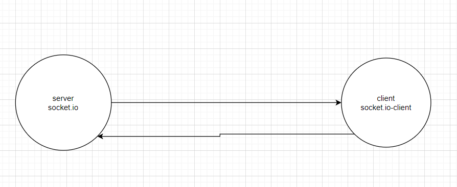

# socket.io-video

### Chat App

in this applections we have chat box and rooms and you can join rooms and seends masseges 

----

i built this app using socket.io for the server and socket.io-client for clients.

---------

how the app work just use this link [chat app](http://localhost:5500/client) and when you ope this link you will wee a box and under the box you will see to buttoms the first oneto add any massege you want the second one to join rooms 

--------

### uml 

------------

[pull link]()